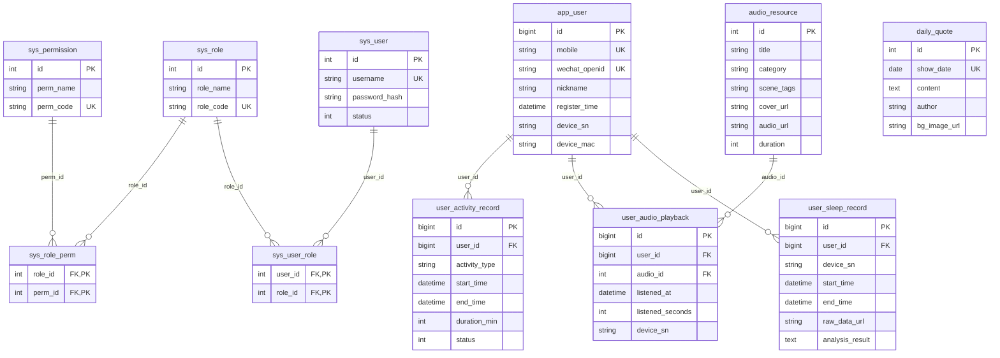

# Backend Status & API Reference

**Project:** Sleep App Backend (Tide)  
**Base URL:** `http://127.0.0.1:8000`  
**API prefix:** `/api/v1`  
**Interactive docs:** `http://127.0.0.1:8000/docs`

This document describes the current database schema and all HTTP endpoints so supervisors and frontend developers can see progress and integrate with the backend.

---

## 1. Database schema (current state)

<!-- SCHEMA_GEN_START -->
### 1.1 Entity–relationship diagram

The diagram below is generated from the SQLAlchemy models. To refresh it after schema changes, run:

```bash
.\.venv\Scripts\python.exe scripts\generate_schema_doc.py
```



### 1.2 Tables summary

| Table | Purpose |
|-------|--------|
| **app_user** | App-side users (Tide end-users); minimal fields for now. |
| **audio_resource** | Audio metadata (title, cover_url, audio_url) for Tide content. |
| **daily_quote** | — |
| **sys_permission** | Permission codes (e.g. audio:read, rbac:manage). |
| **sys_role** | Roles (e.g. SUPER_ADMIN, CONTENT_OP). |
| **sys_role_perm** | Many-to-many: which roles have which permissions. |
| **sys_user** | Admin/operator accounts (login with username + password). |
| **sys_user_role** | Many-to-many: which users have which roles. |
| **user_activity_record** | — |
| **user_audio_playback** | Playback events (what was played, when, for how long). |
| **user_sleep_record** | One record per sleep session; raw data stored at URL, not in DB. |

### 1.3 Column details

**app_user**  
| Column | Type | Constraints |
|--------|------|-------------|
| id | BigInteger | PK, autoincrement |
| mobile | String | unique |
| wechat_openid | String | unique |
| nickname | String | not null |
| register_time | DateTime | not null |
| device_sn | String | — |
| device_mac | String | — |

**audio_resource**  
| Column | Type | Constraints |
|--------|------|-------------|
| id | Integer | PK, autoincrement |
| title | String | not null |
| category | String | — |
| scene_tags | String | — |
| cover_url | String | — |
| audio_url | String | not null |
| duration | Integer | — |

**daily_quote**  
| Column | Type | Constraints |
|--------|------|-------------|
| id | Integer | PK, autoincrement |
| show_date | Date | unique, not null |
| content | Text | not null |
| author | String | — |
| bg_image_url | String | not null |

**sys_permission**  
| Column | Type | Constraints |
|--------|------|-------------|
| id | Integer | PK, autoincrement |
| perm_name | String | not null |
| perm_code | String | unique, not null |

**sys_role**  
| Column | Type | Constraints |
|--------|------|-------------|
| id | Integer | PK, autoincrement |
| role_name | String | not null |
| role_code | String | unique, not null |

**sys_role_perm**  
| Column | Type | Constraints |
|--------|------|-------------|
| role_id | Integer | PK, autoincrement, FK → sys_role.id |
| perm_id | Integer | PK, autoincrement, FK → sys_permission.id |

**sys_user**  
| Column | Type | Constraints |
|--------|------|-------------|
| id | Integer | PK, autoincrement |
| username | String | unique, not null |
| password_hash | String | not null |
| status | Integer | not null |

**sys_user_role**  
| Column | Type | Constraints |
|--------|------|-------------|
| user_id | Integer | PK, autoincrement, FK → sys_user.id |
| role_id | Integer | PK, autoincrement, FK → sys_role.id |

**user_activity_record**  
| Column | Type | Constraints |
|--------|------|-------------|
| id | BigInteger | PK, autoincrement |
| user_id | BigInteger | FK → app_user.id, not null |
| activity_type | String | not null |
| start_time | DateTime | not null |
| end_time | DateTime | — |
| duration_min | Integer | — |
| status | SmallInteger | not null |

**user_audio_playback**  
| Column | Type | Constraints |
|--------|------|-------------|
| id | BigInteger | PK, autoincrement |
| user_id | BigInteger | FK → app_user.id, not null |
| audio_id | Integer | FK → audio_resource.id, not null |
| listened_at | DateTime | not null |
| listened_seconds | Integer | not null |
| device_sn | String | — |

**user_sleep_record**  
| Column | Type | Constraints |
|--------|------|-------------|
| id | BigInteger | PK, autoincrement |
| user_id | BigInteger | FK → app_user.id, not null |
| device_sn | String | not null |
| start_time | DateTime | not null |
| end_time | DateTime | not null |
| raw_data_url | String | not null |
| analysis_result | Text | — |

<!-- SCHEMA_GEN_END -->

---

## 2. API endpoints (full list)

All admin endpoints (except login) require the header:

`Authorization: Bearer <access_token>`

Token is obtained from `POST /api/v1/auth/login`.

---

### 2.1 Auth

| Method | Path | Description |
|--------|------|-------------|
| POST | `/api/v1/auth/login` | Admin login. Body: `{"username","password"}`. Returns `access_token`. |

---

### 2.2 Admin – Audio resources

**Prefix:** `/api/v1/admin/audios`  
**Permissions:** `audio:read`, `audio:create`, `audio:update`, `audio:delete` (checked in service layer).

| Method | Path | Description |
|--------|------|-------------|
| GET | `/api/v1/admin/audios` | List audios. Query: `page`, `size`. |
| POST | `/api/v1/admin/audios` | Create audio. Body: `title`, `cover_url?`, `audio_url`. |
| PUT | `/api/v1/admin/audios/{audio_id}` | Update audio. Body: `title?`, `cover_url?`, `audio_url?`. |
| DELETE | `/api/v1/admin/audios/{audio_id}` | Delete audio. Returns 204. |

---

### 2.3 Admin – RBAC (users, roles, permissions)

**Prefix:** `/api/v1/admin/rbac`  
**Permission:** `rbac:manage`.

| Method | Path | Description |
|--------|------|-------------|
| POST | `/api/v1/admin/rbac/users` | Create operator user. Body: `username`, `password`, `status?`. |
| GET | `/api/v1/admin/rbac/users` | List users. Query: `page`, `size`. |
| POST | `/api/v1/admin/rbac/roles` | Create role. Body: `role_name`, `role_code`. |
| GET | `/api/v1/admin/rbac/roles` | List all roles. |
| POST | `/api/v1/admin/rbac/permissions` | Create permission. Body: `perm_name`, `perm_code`. |
| GET | `/api/v1/admin/rbac/permissions` | List all permissions. |
| POST | `/api/v1/admin/rbac/users/{user_id}/roles/{role_code}` | Assign role to user. |
| DELETE | `/api/v1/admin/rbac/users/{user_id}/roles/{role_code}` | Revoke role from user. |
| POST | `/api/v1/admin/rbac/roles/{role_code}/permissions/{perm_code}` | Assign permission to role. |
| DELETE | `/api/v1/admin/rbac/roles/{role_code}/permissions/{perm_code}` | Revoke permission from role. |

---

### 2.4 Admin – App user data (sleep records, playbacks)

**Prefix:** `/api/v1/admin/users`  
**Permissions:** `app_user:create`, `app_user:read`, `sleep_record:create`, `sleep_record:read`, `audio_playback:create`, `audio_playback:read`.

| Method | Path | Description |
|--------|------|-------------|
| POST | `/api/v1/admin/users` | Create app user. Body: `mobile?`, `nickname?`, `device_sn?`. |
| GET | `/api/v1/admin/users/{user_id}/sleep-records` | List sleep records for user. Query: `page`, `size`. |
| POST | `/api/v1/admin/users/{user_id}/sleep-records` | Create sleep record. Body: `device_sn`, `start_time`, `end_time`, `raw_data_url`, `analysis_result?`. |
| GET | `/api/v1/admin/users/{user_id}/audio-playbacks` | List playback records for user. Query: `page`, `size`. |
| POST | `/api/v1/admin/users/{user_id}/audio-playbacks` | Create playback record. Body: `audio_id`, `listened_at`, `listened_seconds?`, `device_sn?`. |

---

## 3. Permission codes (seeded for SUPER_ADMIN)

These permission codes exist and control access to the above endpoints:

| Code | Purpose |
|------|--------|
| `audio:read` | List audio resources |
| `audio:create` | Create audio |
| `audio:update` | Update audio |
| `audio:delete` | Delete audio |
| `rbac:manage` | Manage users, roles, permissions (create/list/assign/revoke) |
| `app_user:create` | Create app users |
| `app_user:read` | Read app users (used for list if added) |
| `sleep_record:create` | Create user sleep records |
| `sleep_record:read` | List user sleep records |
| `audio_playback:create` | Create user audio playbacks |
| `audio_playback:read` | List user audio playbacks |

---

## 4. Strategy & recommendations (basics first, reduce debt)

*Aligned with: basic functionality first; over-engineering is acceptable only when grounded in real business; design without implementation or disconnected from the product is redundant.*

### Where we stand

- **Done and tied to business:** RBAC (admin login, roles, permissions), app-user auth (phone/WeChat login, JWT), app APIs (daily quote, audios with filters, activity start/end/history), admin content (daily quotes, audios CRUD, stats). DB schema and Alembic migration for new tables/columns are in place.
- **Existing but not yet critical path:** Admin creation of app users and manual sleep/playback records (useful for ops; not required for the main app flow). Legacy tables `user_sleep_record` and `user_audio_playback` coexist with `user_activity_record`; no need to remove them until product clearly prefers one model.

### Suggested order of work

1. **Finish and harden basics**  
   - Lock down the core flows: app login → home (quote) → audios → activity start/end/history.  
   - Ensure env, secrets, and DB (including `python -m app.scripts.init_db` and `alembic upgrade head`) are documented and used consistently.  
   - No new “framework” or big refactors until these flows are stable and used by the product.

2. **Scale / versioning / full-stack expansion only when needed**  
   - **DB scaling (read replicas, sharding):** Research when traffic or product requirements justify it; don’t build it in advance.  
   - **DB versioning:** Alembic is already in place; keep using it for every schema change so the DB and code stay in sync and technical debt doesn’t accumulate.  
   - **Large-scale or “full business expansion”:** Design and implement in small steps, one slice at a time (e.g. one new domain or one new integration), and only when the product actually needs it.

3. **How to “think in advance” without over-building**  
   - Before adding a feature, write down: *which user action or which business metric this serves.* If you can’t, defer it.  
   - For each schema or API change: one migration, one deployable step; avoid big-bang “future-proof” designs.  
   - Keep this doc and the API list up to date so the team and supervisors share one source of truth and can spot scope creep early.

### Summary

Prioritise **basic flows and stability**; do **research and light design** for scaling and expansion, but **implement** only when the business need is clear. That keeps the codebase lean and reduces the chance of errors and technical debt later.

---

## 5. How to keep this document up to date

- **When you add or change tables:** run  
  `.\.venv\Scripts\python.exe scripts\generate_schema_doc.py`  
  to regenerate the Mermaid ER diagram and the “Tables summary” / “Column details” sections in this file (the script overwrites the schema section only).
- **When you add or change endpoints:** update the API sections (e.g. Section 2) manually (or extend the script to discover routes from the FastAPI app).

**Viewing the ER diagram:** The diagram is in [Mermaid](https://mermaid.js.org/) format. It renders in GitHub, GitLab, VS Code (Markdown preview), and many other tools. Open this file in any of them to see the diagram; after schema changes, run the script above to refresh it.

---

*Last generated from codebase: see git history or run `scripts/generate_schema_doc.py`.*
